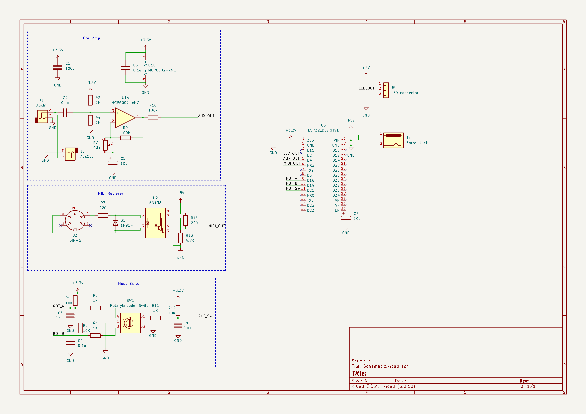

# Multi-input Music Visualizer

A music visualizer that includes two different modes for music visualization:
* Guitar input
* MIDI input

The guitar input can visualize the waveform from the guitar as wave or as fourier transform. The MIDI input maps the pitch of a MIDI input to the display. A rotary encoder is used to choose between inputs and reset the device when the user wants to choose another input.

## Multi-input Music Visualizer schematic

